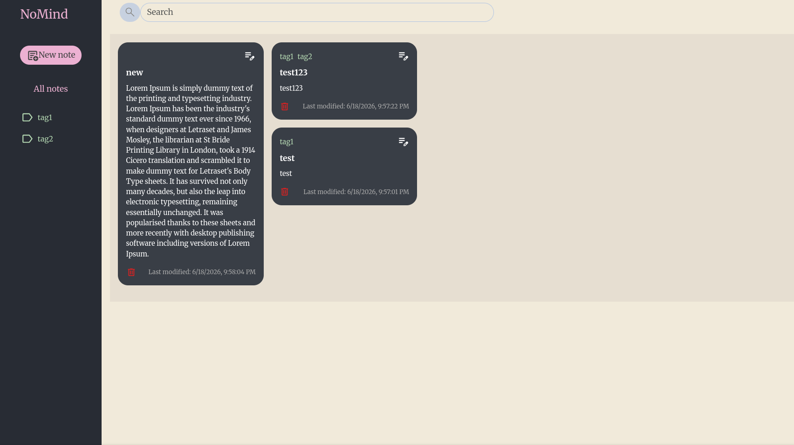
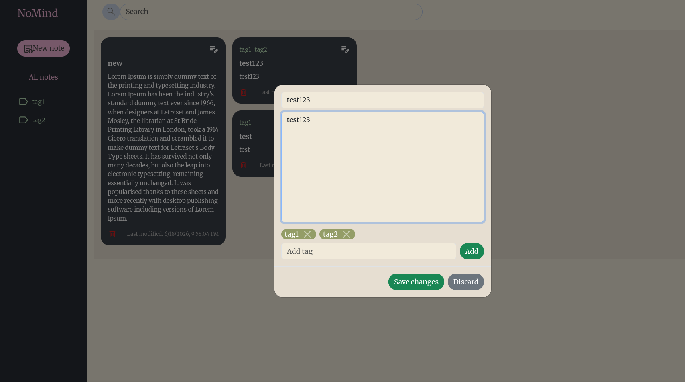
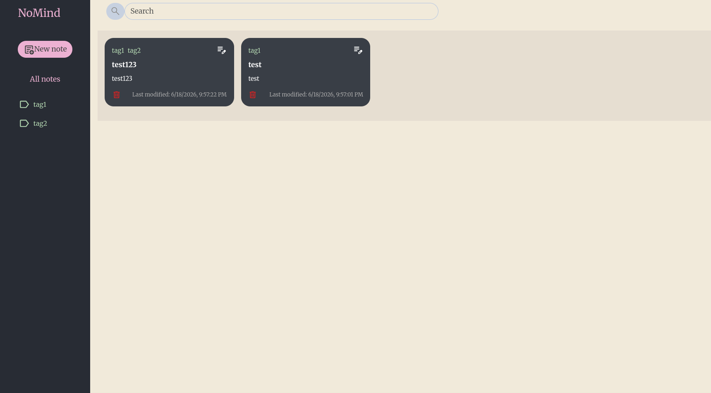

# Notes App

A full-stack notes application with CRUD functionality.

## Tech Stack

**Frontend:** React, TypeScript  
**Backend:** Node.js, TypeScript  

## Features
- Create, read, update, and delete notes. Add, delete tags for notes and filter notes based on tag.

## Preview

### Login page


### Editing note


### Tag filter


## Getting Started

```bash
# Backend
cd backend
npm install
npm start

# Frontend
cd frontend
npm install
npm start
```
